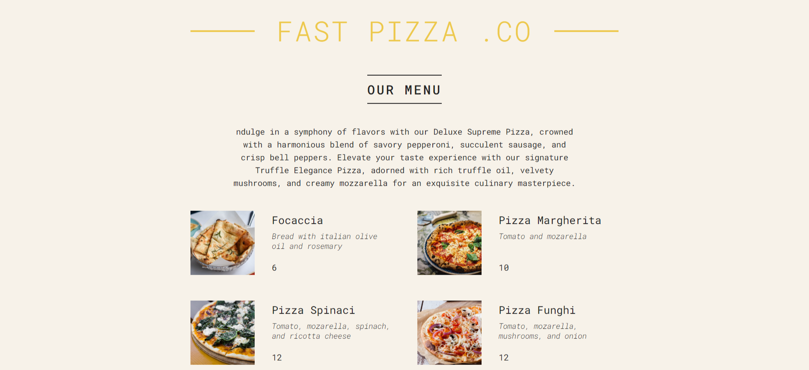

# Simple Pizza Page - React Static Website



Welcome to the Simple Pizza Page! This is a static website built using React, where you can explore various delicious pizzas. Whether you're a pizza lover or just curious about different pizza flavors, this page is sure to make your mouth water.

## Table of Contents

- [Demo](#demo)
- [Features](#features)
- [Installation](#installation)
- [Usage](#usage)
- [Technologies Used](#technologies-used)
- [Contributing](#contributing)
- [License](#license)

## Demo

Check out the live demo of the Simple Pizza Page: [Demo Link](https://krisd23.github.io/React-pizza-menu)

## Features

- View a collection of mouthwatering pizza images.
- Explore different pizza flavors and toppings.

## Installation

To run this Simple Pizza Page locally on your machine, follow these steps:

1. **Clone the repository:**

   ```bash
   git clone https://github.com/your-username/simple-pizza-page.git
   ```

2. **Navigate to the project directory:**

   ```bash
   cd simple-pizza-page
   ```

3. **Install dependencies:**

   ```bash
   npm install
   ```

## Usage

Once you've installed the dependencies, you can run the Simple Pizza Page locally:

```bash
npm start
```

This command will start a development server, and you can access the page by opening your web browser and navigating to `http://localhost:3000`.

## Technologies Used

- React
- HTML
- CSS

## Contributing

Contributions are welcome! If you find any issues or have suggestions to improve this project, feel free to open an issue or a pull request in the GitHub repository. Please follow the existing code style and guidelines.

## License

This project is licensed under the [MIT License](LICENSE).

---
